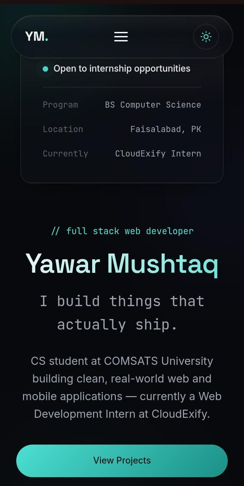

# Yawar Mushtaq — Portfolio

A personal developer portfolio built for the **CloudExify Web Development Internship (Month 1, Project 1)** — and designed from the start to double as a real portfolio for internship and job applications afterward.

Live demo: **_add your Vercel URL here after deploying_**

---

## Table of Contents

- [Overview](#overview)
- [Features](#features)
- [Build Track & Signature Features](#build-track--signature-features)
- [Tech Stack](#tech-stack)
- [Folder Structure](#folder-structure)
- [Installation & Local Development](#installation--local-development)
- [Deployment to Vercel](#deployment-to-vercel)
- [Performance Features](#performance-features)
- [Accessibility Features](#accessibility-features)
- [Screenshots](#screenshots)
- [Future Improvements](#future-improvements)
- [Author](#author)
- [License](#license)

---

## Overview

This is a fully static, single-page portfolio — no frameworks, no build step, no backend. It's written in plain HTML5, CSS3, and vanilla JavaScript (ES modules), and is designed to deploy to Vercel in under a minute with zero configuration.

The visual identity follows the **Glass & Gradient** build track: a dark, frosted-glass UI with a restrained cyan accent, layered depth, and a signature scroll-reactive background glow.

## Features

- Fully responsive, mobile-first layout (mobile → tablet → laptop → desktop → ultra-wide)
- Semantic HTML5 throughout, with a logical heading hierarchy
- Sections: Hero, About, Skills, Projects, Education, Experience, Achievements, Contact, Footer
- Responsive navigation with a mobile hamburger menu (Escape-to-close, click-outside-to-close, focus management)
- Contact form with client-side validation (required fields + email format check, inline success/error states)
- Project filtering by category
- Scroll-triggered, animate-once skill bars
- Dark/Light theme toggle, persisted via `localStorage`
- Typewriter hero intro
- Scroll progress indicator + scroll-to-top button
- Signature scroll-reactive background lighting
- Custom 404 page matching the site's design system
- Full SEO metadata: Open Graph, Twitter Card, canonical tag, `Person` structured data (JSON-LD), `robots.txt`, `sitemap.xml`
- Full icon/manifest set: favicon (SVG + PNG), Apple touch icon, Android/PWA icons, `site.webmanifest`, Windows tile support

## Build Track & Signature Features

**Build Track:** Glass & Gradient (frosted glass cards, blur, soft gradient lighting, cyan accent)

**Signature Features implemented (4 — only 1 was required):**
1. Live theme switcher (dark/light, saved to `localStorage`)
2. Typewriter hero intro
3. Scroll-triggered skill bars (animate once, on entering the viewport)
4. Live project filter (by category, with smooth show/hide)

## Tech Stack

| Layer | Choice |
|---|---|
| Markup | HTML5 (semantic) |
| Styling | CSS3 — custom properties, Grid, Flexbox, `clamp()` fluid type/spacing, no framework |
| Behavior | Vanilla JavaScript (ES2015+ modules), no libraries |
| Fonts | Space Grotesk, Inter, JetBrains Mono (Google Fonts, only the weights actually used) |
| Hosting | Vercel (static, zero-config) |

No React, Vue, Angular, Tailwind, Bootstrap, jQuery, or build tooling is used anywhere in this project.

## Folder Structure

```
portfolio/
├── index.html
├── 404.html
├── robots.txt
├── sitemap.xml
├── site.webmanifest
├── browserconfig.xml
├── vercel.json
├── README.md
├── css/
│   └── style.css
├── js/
│   ├── script.js                 (entry point)
│   └── modules/
│       ├── theme.js              (dark/light toggle + localStorage)
│       ├── typewriter.js         (hero typing effect)
│       ├── scrollReveal.js       (on-scroll fade/slide-in)
│       ├── skillBars.js          (animate-once skill bars)
│       ├── projectFilter.js      (project category filter)
│       ├── scrollProgress.js     (top progress bar + scroll-to-top)
│       ├── navHighlight.js       (active link + mobile menu behavior)
│       ├── spotlight.js          (signature scroll-reactive glow)
│       └── contactForm.js        (contact form validation)
├── assets/
│   ├── images/
│   │   └── og-cover.png          (Open Graph / Twitter share image)
│   ├── icons/
│   │   ├── favicon.svg
│   │   ├── favicon-16x16.png
│   │   ├── favicon-32x32.png
│   │   ├── apple-touch-icon.png
│   │   ├── icon-192.png
│   │   ├── icon-512.png
│   │   └── mstile-150x150.png
│   └── resume/
│       └── Yawar_Mushtaq_Resume.pdf
└── screenshots/
    └── (desktop.png, mobile.png — add before submitting)
```

## Installation & Local Development

No dependencies, no build step. Clone the repo and open it, or serve it locally:

```bash
git clone https://github.com/yawarmushtaq33/cloudexify-web-p1-yawarmushtaq.git
cd cloudexify-web-p1-yawarmushtaq

# Option A — just open it
open index.html

# Option B — serve it (recommended, since JS uses ES modules which need http:// not file://)
npx serve .
```

Then visit `http://localhost:3000` (or whatever port your server prints).

> **Note:** because `js/script.js` is loaded as an ES module (`type="module"`), opening `index.html` directly via `file://` will throw a CORS error in some browsers. Always use a local server (or the deployed Vercel link) when testing.

## Deployment to Vercel

1. Push this folder to a GitHub repository.
2. Go to [vercel.com](https://vercel.com) and sign in with GitHub.
3. **Add New Project** → import the repository.
4. Framework preset: **Other** (static site — no build command needed).
5. Click **Deploy**. Vercel gives you a live link like `yourname-portfolio.vercel.app`.
6. Every future `git push` auto-redeploys — the live link always stays current.

Alternative: install the Vercel CLI (`npm i -g vercel`), run `vercel` inside the project folder, and follow the prompts.

**After deploying**, update these placeholders with your real URL:
- `<link rel="canonical">` and `og:url` / `twitter:image` in `index.html`
- The `Person` JSON-LD `url` and `image` fields in `index.html`
- `sitemap.xml` and `robots.txt`

## Performance Features

- Zero framework/runtime overhead — plain HTML/CSS/JS only
- Google Fonts requests only the font weights actually used in the CSS (no dead weight)
- `font-display: swap` to avoid invisible-text-on-load
- Icons consolidated into a single inline SVG sprite (`<use>`) instead of duplicated markup
- `backdrop-filter` blur kept light (14px) rather than heavy, for cheaper compositing
- Scroll-driven effects (progress bar, background glow) are `requestAnimationFrame`-throttled
- `Cache-Control` headers configured in `vercel.json` for static assets
- `prefers-reduced-motion` respected — all animations/transitions collapse for users who request less motion

**Recommended next step:** run a Lighthouse audit on the deployed URL and address anything it flags (e.g. further image compression if real project screenshots are added later).

## Accessibility Features

- Skip-to-content link for keyboard users
- Semantic landmarks (`header`, `nav`, `main`, `footer`) and a logical heading hierarchy
- Visible `:focus-visible` styles on all interactive elements
- `aria-label`, `aria-expanded`, `aria-pressed`, and `aria-live` used where they add real information (not redundantly over visible text)
- Mobile menu closes on **Escape** and on outside click, with focus returned to the toggle button
- Color contrast checked between text and background in both themes
- All animations respect `prefers-reduced-motion`

## Screenshots

Add these to `screenshots/` before submitting (see `screenshots/README.md` for exact filenames):
- `desktop.png` — homepage at a desktop width (~1440px)
- `mobile.png` — homepage at a mobile width (~390px)

## Future Improvements

- Wire up real project deployment links (currently marked "Coming Soon")
- Add a lightweight backend or form service (e.g. Formspree) so the contact form actually delivers messages
- Add real project screenshots with lazy-loaded, compressed images
- Run and act on a full Lighthouse performance/SEO/accessibility audit post-deployment

## Author

**Yawar Mushtaq**
Computer Science student, COMSATS University Islamabad (Wah Campus) · CloudExify Web Development Intern

- GitHub: [github.com/yawarmushtaq33](https://github.com/yawarmushtaq33)
- LinkedIn: [linkedin.com/in/yawar-mushtaq-2865573a6](https://www.linkedin.com/in/yawar-mushtaq-2865573a6)
- Email: yawarmushtaq383@gmail.com

## License

This project is shared for personal portfolio and internship-review purposes. Feel free to reference the structure or techniques, but please don't republish the content (name, photos, resume, copy) as your own.
## Screenshots

### Desktop


### Mobile

